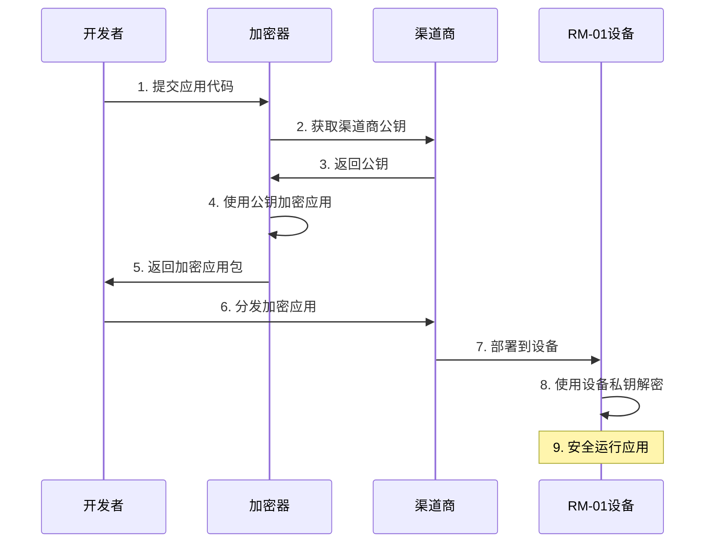

import { Callout } from 'fumadocs-ui/components/callout'
import { Card, Cards } from 'fumadocs-ui/components/card'
import { Step, Steps } from 'fumadocs-ui/components/steps'
import { Tabs, Tab } from 'fumadocs-ui/components/tabs'

<Callout type="info">
  本文档提供了 RM-01 应用开发与企业部署的详细技术指南，帮助开发者和服务商充分利用 RM-01 的硬件特性，打造安全高效的 AI 应用解决方案。
</Callout>

## 概览

- [开发前准备](#开发前准备)
- [环境搭建](#环境搭建)
- [应用开发](#应用开发)
- [安全加密实现](#安全加密实现)
- [部署与集成](#部署与集成)
- [性能优化](#性能优化)
- [故障诊断](#故障诊断)

## 开发前准备

### 1. 硬件架构了解

<Callout type="tip">
  在开始开发前，理解 RM-01 的硬件架构至关重要
</Callout>

<div className="flex justify-center w-full mb-6">
  <div className="max-w-2xl w-full">
    <div className="flex flex-row justify-between mb-10 gap-4">
      <div className="border border-blue-300 dark:border-blue-700 bg-blue-50 dark:bg-blue-900/30 p-3 rounded-md text-center w-1/3 dark:text-blue-300">
        密钥存储
      </div>
      <div className="border border-purple-300 dark:border-purple-700 bg-purple-50 dark:bg-purple-900/30 p-3 rounded-md text-center w-1/3 dark:text-purple-300">
        USB-C网络接口
      </div>
      <div className="border border-indigo-300 dark:border-indigo-700 bg-indigo-50 dark:bg-indigo-900/30 p-3 rounded-md text-center w-1/3 dark:text-indigo-300">
        模型权重存储
      </div>
      <div className="border border-teal-300 dark:border-teal-700 bg-teal-50 dark:bg-teal-900/30 p-3 rounded-md text-center w-1/3 dark:text-teal-300">
        风扇调速
      </div>
    </div>

    <div className="flex justify-between mb-10 gap-4">
      <div className="w-1/3 flex justify-center">
        <div className="dark:text-gray-400">↓</div>
      </div>
      <div className="w-1/3 flex justify-center">
        <div className="dark:text-gray-400">↓</div>
      </div>
      <div className="w-1/3 flex justify-center">
        <div className="dark:text-gray-400">↓</div>
      </div>
      <div className="w-1/3 flex justify-center">
        <div className="dark:text-gray-400">↓</div>
      </div>
    </div>

    <div className="flex justify-between mb-10 gap-4">
      <div className="border border-blue-300 dark:border-blue-700 bg-blue-50 dark:bg-blue-900/30 p-3 rounded-md text-center w-1/3 dark:text-blue-300">
        控制模块
      </div>
      <div className="border border-purple-300 dark:border-purple-700 bg-purple-50 dark:bg-purple-900/30 p-3 rounded-md text-center w-1/3 dark:text-purple-300">
        金手指网络模块
      </div>
      <div className="border border-orange-300 dark:border-orange-700 bg-orange-50 dark:bg-orange-900/30 p-3 rounded-md text-center w-1/3 flex-grow dark:text-orange-300">
        推理模块
      </div>
      <div className="border border-green-300 dark:border-green-700 bg-green-50 dark:bg-green-900/30 p-3 rounded-md text-center w-1/3 dark:text-green-300">
        数据模块
      </div>
    </div>

    <div className="flex justify-center mb-4">
      <div className="flex w-3/4 justify-between">
        <div className="dark:text-gray-400">↘</div>
        <div className="dark:text-gray-400">↘</div>
        <div className="dark:text-gray-400">↙</div>
        <div className="dark:text-gray-400">↙</div>
      </div>
    </div>

    <div className="flex justify-center">
      <div className="border border-amber-300 dark:border-amber-700 bg-amber-50 dark:bg-amber-900/30 p-3 rounded-md text-center w-1/2 dark:text-amber-300">
        数据交换中枢
      </div>
    </div>
  </div>
</div>

<div className="grid grid-cols-1 md:grid-cols-3 gap-4 mt-6">
  <Card title="MIM (模型推理模块)" icon="🧠">
    <div className="p-3 bg-blue-50 dark:bg-blue-900/30 rounded-lg mb-2">
      <div className="font-bold text-sm text-blue-800 dark:text-blue-300">核心芯片</div>
      <div className="text-sm dark:text-gray-300">T234 / GB10 </div>
    </div>
    <ul className="list-disc pl-5 text-sm dark:text-gray-300">
      <li>32/64GB LPDDR5 内存</li>
      <li>128GB 高速内存</li>
      <li>最高 800 TOPS 算力</li>
      <li>支持 FP8 精度推理加速</li>
    </ul>
  </Card>
  
  <Card title="ADM (应用部署模块)" icon="🖥️">
    <div className="p-3 bg-purple-50 dark:bg-purple-900/30 rounded-lg mb-2">
      <div className="font-bold text-sm text-purple-800 dark:text-purple-300">部署规格</div>
      <div className="text-sm dark:text-gray-300">X86 架构，8 核 CPU</div>
    </div>
    <ul className="list-disc pl-5 text-sm dark:text-gray-300">
      <li>16GB RAM</li>
      <li>8TB NVMe SSD 存储</li>
      <li>预装 Xinference 数据嵌入引擎</li>
      <li>预装 vLLM 推理框架</li>
    </ul>
  </Card>
  
  <Card title="SAM (安全模块)" icon="🔒">
    <div className="p-3 bg-green-50 dark:bg-green-900/30 rounded-lg mb-2">
      <div className="font-bold text-sm text-green-800 dark:text-green-300">安全特性</div>
      <div className="text-sm dark:text-gray-300">基于 ESP32 安全芯片</div>
    </div>
    <ul className="list-disc pl-5 text-sm dark:text-gray-300">
      <li>硬件级非对称加密</li>
      <li>独立密钥存储区</li>
      <li>防拆机设计</li>
      <li>设备调度控制</li>
    </ul>
  </Card>
</div>

### 2. 开发工具包获取

<Steps>
  <Step>
    ### 注册开发者账户
    访问 [developer.rminte.com](https://developer.rminte.com) 并完成注册流程
  </Step>
  
  <Step>
    ### 下载开发工具包
    登录后下载 RM-01 开发者 SDK
  </Step>
  
  <Step>
    ### 获取文档与参考
    获取开发者文档和 API 参考材料
  </Step>
  
  <Step>
    ### 申请测试权限
    申请测试设备或模拟器访问权限
  </Step>
</Steps>

### 3. 应用场景评估

<Tabs items={['适合场景', '需要评估的场景']}>
  <Tab>
    <div className="grid grid-cols-1 md:grid-cols-2 gap-4">
      <Card title="本地私有化部署" icon="🏢">
        需要本地私有化部署的 AI 应用
      </Card>
      <Card title="高安全需求" icon="🔐">
        对数据安全有高要求的场景
      </Card>
      <Card title="低延迟需求" icon="⚡">
        需要稳定低延迟响应的场景
      </Card>
      <Card title="弱网或离线环境" icon="📶">
        无法保证网络连接的环境
      </Card>
    </div>
  </Tab>
  <Tab>
    <div className="grid grid-cols-1 md:grid-cols-2 gap-4">
      <Card title="超大规模模型" icon="🐘">
        超大规模模型推理 (> 235B 参数)
      </Card>
      <Card title="极高并发请求" icon="🔄">
        极高并发请求 (> 256 并发)
      </Card>
      <Card title="特殊硬件需求" icon="🎛️">
        需要特殊硬件加速的场景
      </Card>
    </div>
  </Tab>
</Tabs>

## 环境搭建

### 1. 开发环境配置

<Tabs items={['本地开发环境', 'Docker 开发环境']}>
  <Tab>
    ```bash
    # 安装 RM-01 开发者工具包
    pip install rminte-sdk

    # 初始化开发环境
    rminte-cli init

    # 验证安装
    rminte-cli verify
    ```
  </Tab>
  <Tab>
    ```dockerfile
    FROM rminte/dev-env:latest

    WORKDIR /app

    # 复制应用代码
    COPY . .

    # 安装依赖
    RUN pip install -r requirements.txt

    # 设置入口点
    ENTRYPOINT ["python", "app.py"]
    ```
  </Tab>
</Tabs>

### 2. 模拟器设置

<Callout>
  RM-01 模拟器可以在开发阶段模拟真实设备环境，帮助测试和调试应用
</Callout>

```bash
# 启动模拟器
rminte-cli simulator start

# 检查模拟器状态
rminte-cli simulator status

# 将应用部署到模拟器
rminte-cli deploy --target simulator --app-path ./my-app
```

### 3. 开发者认证配置

<Steps>
  <Step>
    ### 生成开发者密钥对
    ```bash
    rminte-cli keygen
    ```
  </Step>
  
  <Step>
    ### 注册密钥到平台
    ```bash
    rminte-cli register-key
    ```
  </Step>
  
  <Step>
    ### 验证密钥配置
    ```bash
    rminte-cli verify-auth
    ```
  </Step>
</Steps>

## 应用开发

### 1. 应用架构设计

<Tabs items={['基本架构模板', 'manifest.json']}>
  <Tab>
    ```
    my-rm01-app/
    ├── app/
    │   ├── api/
    │   │   ├── __init__.py
    │   │   └── routes.py
    │   ├── core/
    │   │   ├── __init__.py
    │   │   ├── config.py
    │   │   └── model.py
    │   ├── static/
    │   │   └── ... (静态资源)
    │   ├── templates/
    │   │   └── ... (前端模板)
    │   └── __init__.py
    ├── Dockerfile
    ├── requirements.txt
    ├── app.py
    └── manifest.json
    ```
  </Tab>
  <Tab>
    ```json
    {
      "app_id": "com.example.myapp",
      "name": "我的 RM-01 应用",
      "version": "1.0.0",
      "min_sdk_version": "1.5.0",
      "description": "这是一个示例应用",
      "author": "开发者名称",
      "email": "developer@example.com",
      "models": ["glm-4", "qwen-7b"],
      "memory": "4GB",
      "storage": "10GB",
      "permissions": ["network", "storage"]
    }
    ```
  </Tab>
</Tabs>

### 2. 模型集成

<Tabs items={['使用内置模型', '优化模型调用']}>
  <Tab>
    ```python
    from rminte.models import ModelManager

    # 初始化模型管理器
    model_manager = ModelManager()

    # 获取可用模型列表
    available_models = model_manager.list_models()
    print(f"可用模型: {available_models}")

    # 加载模型
    model = model_manager.load_model("qwen-7b")

    # 模型推理
    response = model.generate(
        prompt="请简要介绍人工智能的发展历史",
        max_tokens=1000,
        temperature=0.7
    )

    print(response)
    ```
  </Tab>
  <Tab>
    ```python
    from rminte.models import ModelManager
    from rminte.utils import performance

    # 使用缓存优化
    @performance.cache
    def get_model_response(prompt, model_name="qwen-7b"):
        model = ModelManager().load_model(model_name)
        return model.generate(prompt=prompt, max_tokens=1000)

    # 批量处理
    def batch_process(prompts, model_name="qwen-7b"):
        model = ModelManager().load_model(model_name)
        
        # 使用模型的批处理能力
        responses = model.batch_generate(
            prompts=prompts,
            max_tokens=1000
        )
        
        return responses
    ```
  </Tab>
</Tabs>

### 3. 应用接口开发

<Tabs items={['RESTful API', 'WebSocket 支持']}>
  <Tab>
    ```python
    from flask import Flask, request, jsonify
    from rminte.models import ModelManager

    app = Flask(__name__)
    model_manager = ModelManager()

    @app.route('/api/v1/generate', methods=['POST'])
    def generate_text():
        data = request.json
        
        if not data or 'prompt' not in data:
            return jsonify({'error': 'Missing prompt parameter'}), 400
        
        prompt = data['prompt']
        model_name = data.get('model', 'qwen-7b')
        max_tokens = data.get('max_tokens', 1000)
        temperature = data.get('temperature', 0.7)
        
        try:
            model = model_manager.load_model(model_name)
            response = model.generate(
                prompt=prompt,
                max_tokens=max_tokens,
                temperature=temperature
            )
            
            return jsonify({
                'text': response,
                'model': model_name
            })
        except Exception as e:
            return jsonify({'error': str(e)}), 500

    if __name__ == '__main__':
        app.run(host='0.0.0.0', port=8000)
    ```
  </Tab>
  <Tab>
    ```python
    from flask import Flask
    from flask_socketio import SocketIO, emit
    from rminte.models import ModelManager

    app = Flask(__name__)
    socketio = SocketIO(app)
    model_manager = ModelManager()

    @socketio.on('generate')
    def handle_generate(data):
        prompt = data.get('prompt')
        model_name = data.get('model', 'qwen-7b')
        
        if not prompt:
            emit('error', {'message': 'Missing prompt parameter'})
            return
        
        try:
            model = model_manager.load_model(model_name)
            
            # 流式生成
            for token in model.generate_stream(prompt=prompt):
                emit('token', {'token': token})
            
            emit('complete')
        except Exception as e:
            emit('error', {'message': str(e)})

    if __name__ == '__main__':
        socketio.run(app, host='0.0.0.0', port=8000)
    ```
  </Tab>
</Tabs>

### 4. 前端界面开发

<Callout type="tip">
  下面是一个基于 React 的简单前端示例，用于与 RM-01 上的 AI 应用交互
</Callout>

```jsx
import React, { useState } from 'react';
import axios from 'axios';

function AIChat() {
  const [prompt, setPrompt] = useState('');
  const [response, setResponse] = useState('');
  const [loading, setLoading] = useState(false);

  const handleSubmit = async (e) => {
    e.preventDefault();
    setLoading(true);
    
    try {
      const result = await axios.post('/api/v1/generate', {
        prompt: prompt,
        model: 'qwen-7b',
        max_tokens: 1000
      });
      
      setResponse(result.data.text);
    } catch (error) {
      console.error('Error:', error);
      setResponse('发生错误，请重试');
    } finally {
      setLoading(false);
    }
  };

  return (
    <div className="chat-container">
      <h1>RM-01 AI 助手</h1>
      
      <form onSubmit={handleSubmit}>
        <textarea
          value={prompt}
          onChange={(e) => setPrompt(e.target.value)}
          placeholder="请输入您的问题..."
          rows={4}
        />
        <button type="submit" disabled={loading || !prompt}>
          {loading ? '处理中...' : '提交'}
        </button>
      </form>
      
      {response && (
        <div className="response">
          <h2>响应：</h2>
          <div className="response-text">{response}</div>
        </div>
      )}
    </div>
  );
}

export default AIChat;
```

### 5. 数据存储

<Tabs items={['加密存储', 'SQLite 数据库']}>
  <Tab>
    ```python
    from rminte.storage import EncryptedStorage

    # 使用加密存储
    storage = EncryptedStorage('app_data')

    # 存储数据
    storage.set('user_preferences', {
        'theme': 'dark',
        'language': 'zh-CN'
    })

    # 读取数据
    preferences = storage.get('user_preferences')
    print(preferences)
    ```
  </Tab>
  <Tab>
    ```python
    import sqlite3

    def init_db():
        conn = sqlite3.connect('app.db')
        c = conn.cursor()
        c.execute('''
        CREATE TABLE IF NOT EXISTS conversations (
            id INTEGER PRIMARY KEY,
            user_id TEXT,
            prompt TEXT,
            response TEXT,
            timestamp DATETIME DEFAULT CURRENT_TIMESTAMP
        )
        ''')
        conn.commit()
        conn.close()

    def save_conversation(user_id, prompt, response):
        conn = sqlite3.connect('app.db')
        c = conn.cursor()
        c.execute(
            "INSERT INTO conversations (user_id, prompt, response) VALUES (?, ?, ?)",
            (user_id, prompt, response)
        )
        conn.commit()
        conn.close()
    ```
  </Tab>
</Tabs>

## 安全加密实现

### 1. 应用加密流程

<Callout type="warning">
  使用 RM-01 的硬件级加密保护您的应用，避免未授权访问和篡改
</Callout>



```python
from rminte.security import AppEncryptor

# 初始化加密器
encryptor = AppEncryptor()

# 获取渠道商公钥
channel_public_key = get_channel_public_key()

# 加密应用
encryptor.encrypt_app(
    app_dir="./my-app",
    output_path="./encrypted-app.rmap",
    public_key=channel_public_key
)

print("应用已加密，可以安全分发")
```

### 2. 数据安全处理

<Steps>
  <Step>
    ### 初始化数据加密器
    ```python
    from rminte.security import DataEncryptor
    
    # 初始化数据加密器
    data_encryptor = DataEncryptor()
    ```
  </Step>
  
  <Step>
    ### 加密敏感数据
    ```python
    # 加密敏感数据
    encrypted_data = data_encryptor.encrypt(sensitive_data)
    
    # 存储加密数据
    with open('encrypted.dat', 'wb') as f:
        f.write(encrypted_data)
    ```
  </Step>
  
  <Step>
    ### 解密数据使用
    ```python
    # 解密数据
    with open('encrypted.dat', 'rb') as f:
        encrypted_data = f.read()
        
    original_data = data_encryptor.decrypt(encrypted_data)
    ```
  </Step>
</Steps>

### 3. 安全通信实现

```python
from rminte.security import SecureChannel
from flask import Flask, request, jsonify

app = Flask(__name__)
secure_channel = SecureChannel()

@app.route('/api/v1/secure-endpoint', methods=['POST'])
def secure_endpoint():
    # 验证请求
    if not secure_channel.verify_request(request):
        return jsonify({'error': 'Unauthorized'}), 401
    
    # 解密请求数据
    data = secure_channel.decrypt_request(request)
    
    # 处理业务逻辑
    result = process_data(data)
    
    # 加密响应
    encrypted_response = secure_channel.encrypt_response(result)
    
    return encrypted_response
```

## 部署与集成

### 1. 打包应用

<Tabs items={['Dockerfile', '打包命令']}>
  <Tab>
    ```dockerfile
    FROM rminte/runtime:latest

    WORKDIR /app

    # 复制应用文件
    COPY ./app /app
    COPY requirements.txt /app/

    # 安装依赖
    RUN pip install -r requirements.txt

    # 暴露端口
    EXPOSE 8000

    # 设置健康检查
    HEALTHCHECK --interval=30s --timeout=10s --start-period=5s --retries=3 \
      CMD curl -f http://localhost:8000/health || exit 1

    # 启动应用
    CMD ["python", "app.py"]
    ```
  </Tab>
  <Tab>
    ```bash
    # 构建镜像
    docker build -t myapp:1.0 .

    # 导出镜像
    docker save myapp:1.0 | gzip > myapp-1.0.tar.gz
    ```
  </Tab>
</Tabs>

### 2. 部署到 RM-01

<Tabs items={['命令行部署', '存储卡部署']}>
  <Tab>
    ```bash
    # 部署应用
    rminte-cli deploy --app-path ./myapp-1.0.tar.gz --target rm01://192.168.1.100

    # 检查部署状态
    rminte-cli status --target rm01://192.168.1.100
    ```
  </Tab>
  <Tab>
    <Steps>
      <Step>
        ### 准备存储卡
        将打包好的应用复制到 CFexpress 卡或 microSD 卡
      </Step>
      
      <Step>
        ### 插入存储卡
        将存储卡插入 RM-01 设备对应的卡槽
      </Step>
      
      <Step>
        ### 自动检测
        设备将自动检测并安装存储卡中的应用
      </Step>
    </Steps>
  </Tab>
</Tabs>

### 3. 与企业系统集成

<Tabs items={['API 网关配置', '用户身份验证']}>
  <Tab>
    ```yaml
    # api-gateway.yaml
    apiVersion: rminte/v1
    kind: ApiGateway
    metadata:
      name: enterprise-gateway
    spec:
      routes:
        - path: /api/v1/ai
          service: myapp
          port: 8000
          methods: [GET, POST]
          auth:
            type: jwt
            issuer: "enterprise-auth-server"
        
        - path: /api/v1/admin
          service: myapp-admin
          port: 8001
          methods: [GET, POST, PUT, DELETE]
          auth:
            type: oidc
            provider: "enterprise-idp"
      
      cors:
        allowOrigins:
          - "https://*.example.com"
        allowMethods:
          - GET
          - POST
        allowHeaders:
          - Content-Type
          - Authorization
    ```
  </Tab>
  <Tab>
    ```python
    from flask import Flask, request, jsonify
    from flask_jwt_extended import JWTManager, jwt_required, get_jwt_identity
    from rminte.auth import EnterpriseAuth

    app = Flask(__name__)
    app.config['JWT_SECRET_KEY'] = 'your-secret-key'
    jwt = JWTManager(app)

    # 企业认证集成
    enterprise_auth = EnterpriseAuth(
        auth_server_url="https://auth.enterprise.com",
        client_id="rm01-app-client",
        client_secret="client-secret"
    )

    @app.route('/api/v1/login', methods=['POST'])
    def login():
        username = request.json.get('username')
        password = request.json.get('password')
        
        # 通过企业认证服务验证用户
        auth_result = enterprise_auth.authenticate(username, password)
        
        if auth_result['success']:
            # 生成JWT令牌
            access_token = create_access_token(identity=username)
            return jsonify(access_token=access_token)
        else:
            return jsonify({"error": "Invalid credentials"}), 401

    @app.route('/api/v1/protected', methods=['GET'])
    @jwt_required()
    def protected():
        current_user = get_jwt_identity()
        return jsonify(logged_in_as=current_user)
    ```
  </Tab>
</Tabs>

## 性能优化

### 1. 模型推理优化

<Tabs items={['模型量化', '批量处理']}>
  <Tab>
    ```python
    from rminte.models import ModelManager
    from rminte.optimization import Quantizer

    # 加载原始模型
    model_manager = ModelManager()
    model = model_manager.load_model("qwen-14b")

    # 创建量化器
    quantizer = Quantizer()

    # 对模型进行量化 (INT8)
    quantized_model = quantizer.quantize(
        model=model,
        quantization_type="int8",
        calibration_dataset="./calibration_data"
    )

    # 保存量化后的模型
    quantized_model.save("./qwen-14b-int8")

    # 加载量化后的模型进行推理
    optimized_model = model_manager.load_model("./qwen-14b-int8")
    response = optimized_model.generate(prompt="你好，请介绍一下自己")
    ```
  </Tab>
  <Tab>
    ```python
    from rminte.models import ModelManager
    from rminte.optimization import BatchProcessor

    model_manager = ModelManager()
    model = model_manager.load_model("qwen-7b")

    # 创建批处理器
    batch_processor = BatchProcessor(model=model, batch_size=16)

    # 准备批量请求
    prompts = [
        "请解释什么是机器学习",
        "人工智能的应用场景有哪些",
        "深度学习与传统机器学习的区别",
        # ... 更多请求
    ]

    # 并行处理
    results = batch_processor.process(prompts)

    for i, result in enumerate(results):
        print(f"问题 {i+1}: {prompts[i]}")
        print(f"回答: {result}\n")
    ```
  </Tab>
</Tabs>

### 2. 内存管理

<Callout type="warning">
  有效的内存管理对于 RM-01 上的应用性能至关重要
</Callout>

```python
from rminte.optimization import MemoryManager

# 初始化内存管理器
memory_manager = MemoryManager()

# 监控内存使用
@memory_manager.monitor
def process_large_dataset(dataset):
    results = []
    for data in dataset:
        # 处理数据
        result = process_single_item(data)
        results.append(result)
        
        # 手动释放不再需要的大型对象
        memory_manager.collect_garbage_if_needed()
    
    return results

# 设置内存限制
@memory_manager.limit(max_gb=4)
def memory_intensive_operation():
    # 大量内存操作
    pass
```

### 3. 并发处理

```python
from rminte.optimization import ConcurrencyManager
import asyncio

# 初始化并发管理器
concurrency_manager = ConcurrencyManager(max_workers=8)

# 异步处理多个请求
async def process_requests(requests):
    async def process_single(req):
        # 处理单个请求
        return {"request_id": req["id"], "result": calculate_result(req)}
    
    # 限制并发数量
    tasks = [process_single(req) for req in requests]
    results = await concurrency_manager.gather(tasks)
    
    return results

# 使用线程池
def parallel_process(items):
    return concurrency_manager.map(process_function, items)
```

## 故障诊断

### 1. 日志管理

<Tabs items={['基础日志记录', '结构化日志']}>
  <Tab>
    ```python
    from rminte.diagnostics import Logger

    # 初始化日志管理器
    logger = Logger(
        app_name="myapp",
        log_level="INFO",
        log_file="./logs/app.log",
        rotation="10 MB"
    )

    # 记录不同级别的日志
    logger.info("应用已启动")
    logger.warning("发现潜在问题")
    logger.error("处理请求时出错", exc_info=True)
    logger.debug("详细调试信息")
    
    # 性能日志
    @logger.performance
    def time_consuming_operation():
        # 耗时操作
        pass
    ```
  </Tab>
  <Tab>
    ```python
    from rminte.diagnostics import Logger

    # 初始化日志管理器
    logger = Logger(
        app_name="myapp",
        log_level="INFO",
        log_file="./logs/app.log",
        rotation="10 MB"
    )

    # 结构化日志
    logger.info("用户操作", extra={
        "user_id": "12345",
        "action": "login",
        "ip_address": "192.168.1.1"
    })
    ```
  </Tab>
</Tabs>

### 2. 监控与告警

<div className="grid grid-cols-1 md:grid-cols-2 gap-6 mt-4">
  <div>
    ```python
    from rminte.diagnostics import Monitor
    import time

    # 初始化监控器
    monitor = Monitor(app_name="myapp")

    # 注册监控指标
    request_counter = monitor.counter(
        name="requests_total",
        description="Total number of requests"
    )

    response_time = monitor.histogram(
        name="response_time_seconds",
        description="Request response time in seconds",
        buckets=[0.1, 0.5, 1, 2, 5]
    )

    # 监控端点处理
    @app.route('/api/v1/process', methods=['POST'])
    def process_api():
        # 增加请求计数
        request_counter.inc()
        
        # 记录响应时间
        start_time = time.time()
        
        try:
            # 处理请求
            result = process_request(request.json)
            return jsonify(result)
        finally:
            # 记录处理时间
            response_time.observe(time.time() - start_time)
    ```
  </div>
  
  <div>
    ```python
    from rminte.diagnostics import AlertManager

    # 设置告警
    alert_manager = AlertManager()

    # 添加告警规则
    alert_manager.add_rule(
        name="high_response_time",
        condition="response_time_seconds_avg > 2",
        duration="5m",
        severity="warning",
        message="API 响应时间过长"
    )

    # 配置通知渠道
    alert_manager.add_notification_channel(
        type="email",
        name="admin_email",
        config={"to": "admin@example.com"}
    )
    ```
  </div>
</div>

### 3. 故障排查工具

```python
from rminte.diagnostics import Debugger, SystemInfo

# 初始化调试器
debugger = Debugger()

# 捕获异常并收集信息
@debugger.catch
def problematic_function():
    # 可能出现问题的代码
    result = 1 / 0
    return result

# 收集系统信息
sys_info = SystemInfo()
system_report = sys_info.collect()

print(f"RM-01 设备信息:")
print(f"  操作系统: {system_report['os']}")
print(f"  CPU 使用率: {system_report['cpu_usage']}%")
print(f"  内存使用: {system_report['memory_used']} / {system_report['memory_total']} GB")
print(f"  磁盘空间: {system_report['disk_used']} / {system_report['disk_total']} GB")
print(f"  网络状态: {system_report['network_status']}")

# 健康检查
health_result = sys_info.health_check()
for service, status in health_result.items():
    print(f"  {service}: {'正常' if status else '异常'}")
```

---

<Callout type="success" emoji="🎉">
  本文档提供了 RM-01 应用开发与企业部署的详细技术指南。通过遵循这些最佳实践，开发者和服务商可以充分利用 RM-01 的硬件特性，打造安全高效的 AI 应用解决方案。
</Callout>

<div className="text-sm text-gray-500 mt-8">
  © 2025 RMinte Inc. 保留所有权利。
</div>

## 探索更多资源

<Cards>
  <Card title="开发者社区" href="https://developer.rminte.com/forum" icon="👥" />
  <Card title="API 文档" href="https://developer.rminte.com/api" icon="📚" />
  <Card title="示例项目" href="https://github.com/rminte/examples" icon="💻" />
</Cards>