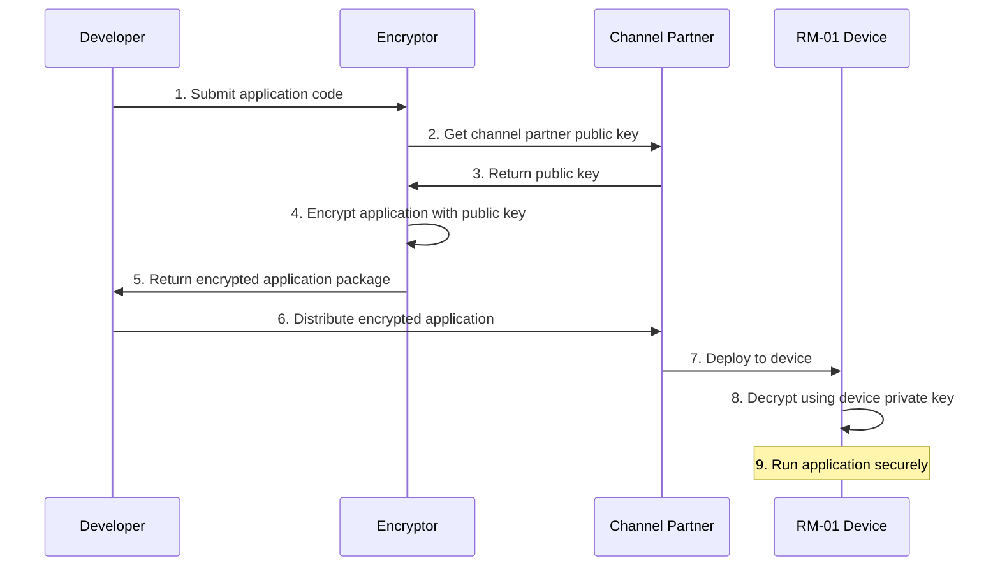

import { Callout } from 'fumadocs-ui/components/callout'
import { Card, Cards } from 'fumadocs-ui/components/card'
import { Step, Steps } from 'fumadocs-ui/components/steps'
import { Tabs, Tab } from 'fumadocs-ui/components/tabs'

<Callout type="info">
  This document provides detailed technical guidelines for RM-01 application development and enterprise deployment, helping developers and service providers fully utilize RM-01's hardware features to create secure and efficient AI application solutions.
</Callout>

## Overview

- [Preparation Before Development](#preparation-before-development)
- [Environment Setup](#environment-setup)
- [Application Development](#application-development)
- [Security Implementation](#security-implementation)
- [Deployment and Integration](#deployment-and-integration)
- [Performance Optimization](#performance-optimization)
- [Troubleshooting](#troubleshooting)

Welcome to the docs! You can start writing documents in `/content/docs`.

## What is Next?

<Cards>
  <Card title="Learn more about Next.js" href="https://nextjs.org/docs" />
  <Card title="Learn more about Fumadocs" href="https://fumadocs.vercel.app" />
</Cards>

## Preparation Before Development

### 1. Understanding Hardware Architecture

<Callout type="tip">
  Understanding the hardware architecture of RM-01 is crucial before starting development
</Callout>

<div className="flex justify-center w-full mb-6">
  <div className="max-w-2xl w-full">
    <div className="flex flex-row justify-between mb-10 gap-4">
      <div className="border border-blue-300 dark:border-blue-700 bg-blue-50 dark:bg-blue-900/30 p-3 rounded-md text-center w-1/3 dark:text-blue-300">
        Key Storage
      </div>
      <div className="border border-purple-300 dark:border-purple-700 bg-purple-50 dark:bg-purple-900/30 p-3 rounded-md text-center w-1/3 dark:text-purple-300">
        USB-C Network Interface
      </div>
      <div className="border border-indigo-300 dark:border-indigo-700 bg-indigo-50 dark:bg-indigo-900/30 p-3 rounded-md text-center w-1/3 dark:text-indigo-300">
        Model Weight Storage
      </div>
      <div className="border border-teal-300 dark:border-teal-700 bg-teal-50 dark:bg-teal-900/30 p-3 rounded-md text-center w-1/3 dark:text-teal-300">
        Fan Speed Control
      </div>
    </div>

    <div className="flex justify-between mb-10 gap-4">
      <div className="w-1/3 flex justify-center">
        <div className="dark:text-gray-400">↓</div>
      </div>
      <div className="w-1/3 flex justify-center">
        <div className="dark:text-gray-400">↓</div>
      </div>
      <div className="w-1/3 flex justify-center">
        <div className="dark:text-gray-400">↓</div>
      </div>
      <div className="w-1/3 flex justify-center">
        <div className="dark:text-gray-400">↓</div>
      </div>
    </div>

    <div className="flex justify-between mb-10 gap-4">
      <div className="border border-blue-300 dark:border-blue-700 bg-blue-50 dark:bg-blue-900/30 p-3 rounded-md text-center w-1/3 dark:text-blue-300">
        Control Module
      </div>
      <div className="border border-purple-300 dark:border-purple-700 bg-purple-50 dark:bg-purple-900/30 p-3 rounded-md text-center w-1/3 dark:text-purple-300">
        Golden Finger Network Module
      </div>
      <div className="border border-orange-300 dark:border-orange-700 bg-orange-50 dark:bg-orange-900/30 p-3 rounded-md text-center w-1/3 flex-grow dark:text-orange-300">
        Inference Module
      </div>
      <div className="border border-green-300 dark:border-green-700 bg-green-50 dark:bg-green-900/30 p-3 rounded-md text-center w-1/3 dark:text-green-300">
        Data Module
      </div>
    </div>

    <div className="flex justify-center mb-4">
      <div className="flex w-3/4 justify-between">
        <div className="dark:text-gray-400">↘</div>
        <div className="dark:text-gray-400">↘</div>
        <div className="dark:text-gray-400">↙</div>
        <div className="dark:text-gray-400">↙</div>
      </div>
    </div>

    <div className="flex justify-center">
      <div className="border border-amber-300 dark:border-amber-700 bg-amber-50 dark:bg-amber-900/30 p-3 rounded-md text-center w-1/2 dark:text-amber-300">
        Data Exchange Hub
      </div>
    </div>
  </div>
</div>

<div className="grid grid-cols-1 md:grid-cols-3 gap-4 mt-6">
  <Card title="MIM (Model Inference Module)" icon="🧠">
    <div className="p-3 bg-blue-50 dark:bg-blue-900/30 rounded-lg mb-2">
      <div className="font-bold text-sm text-blue-800 dark:text-blue-300">Core Chip</div>
      <div className="text-sm dark:text-gray-300">T234 / GB10 </div>
    </div>
    <ul className="list-disc pl-5 text-sm dark:text-gray-300">
      <li>32/64GB LPDDR5 memory</li>
      <li>128GB high-speed memory</li>
      <li>Up to 800 TOPS computing power</li>
      <li>Supports FP8 precision inference acceleration</li>
    </ul>
  </Card>
  
  <Card title="ADM (Application Deployment Module)" icon="🖥️">
    <div className="p-3 bg-purple-50 dark:bg-purple-900/30 rounded-lg mb-2">
      <div className="font-bold text-sm text-purple-800 dark:text-purple-300">Deployment Specifications</div>
      <div className="text-sm dark:text-gray-300">X86 architecture, 8-core CPU</div>
    </div>
    <ul className="list-disc pl-5 text-sm dark:text-gray-300">
      <li>16GB RAM</li>
      <li>8TB NVMe SSD storage</li>
      <li>Pre-installed Xinference data embedding engine</li>
      <li>Pre-installed vLLM inference framework</li>
    </ul>
  </Card>
  
  <Card title="SAM (Security Module)" icon="🔒">
    <div className="p-3 bg-green-50 dark:bg-green-900/30 rounded-lg mb-2">
      <div className="font-bold text-sm text-green-800 dark:text-green-300">Security Features</div>
      <div className="text-sm dark:text-gray-300">Based on ESP32 security chip</div>
    </div>
    <ul className="list-disc pl-5 text-sm dark:text-gray-300">
      <li>Hardware-level asymmetric encryption</li>
      <li>Independent key storage area</li>
      <li>Anti-tamper design</li>
      <li>Device scheduling control</li>
    </ul>
  </Card>
</div>

### 2. Obtaining Development Kit

<Steps>
  <Step>
    ### Register Developer Account
    Visit [developer.rminte.com](https://developer.rminte.com) and complete the registration process
  </Step>
  
  <Step>
    ### Download Development Kit
    Download the RM-01 developer SDK after logging in
  </Step>
  
  <Step>
    ### Get Documentation and References
    Obtain developer documentation and API reference materials
  </Step>
  
  <Step>
    ### Apply for Testing Permissions
    Apply for access to test devices or simulators
  </Step>
</Steps>

### 3. Application Scenario Assessment

<Tabs items={['Suitable Scenarios', 'Scenarios Requiring Evaluation']}>
  <Tab>
    <div className="grid grid-cols-1 md:grid-cols-2 gap-4">
      <Card title="Local Private Deployment" icon="🏢">
        AI applications requiring local private deployment
      </Card>
      <Card title="High Security Requirements" icon="🔐">
        Scenarios with high data security requirements
      </Card>
      <Card title="Low Latency Requirements" icon="⚡">
        Scenarios requiring stable low-latency responses
      </Card>
      <Card title="Weak Network or Offline Environments" icon="📶">
        Environments where network connectivity cannot be guaranteed
      </Card>
    </div>
  </Tab>
  <Tab>
    <div className="grid grid-cols-1 md:grid-cols-2 gap-4">
      <Card title="Very Large Scale Models" icon="🐘">
        Very large scale model inference (> 235B parameters)
      </Card>
      <Card title="Extremely High Concurrent Requests" icon="🔄">
        Extremely high concurrent requests (> 256 concurrent)
      </Card>
      <Card title="Special Hardware Requirements" icon="🎛️">
        Scenarios requiring special hardware acceleration
      </Card>
    </div>
  </Tab>
</Tabs>

## Environment Setup

### 1. Development Environment Configuration

<Tabs items={['Local Development Environment', 'Docker Development Environment']}>
  <Tab>
    ```bash
    # Install RM-01 developer toolkit
    pip install rminte-sdk

    # Initialize development environment
    rminte-cli init

    # Verify installation
    rminte-cli verify
    ```
  </Tab>
  <Tab>
    ```dockerfile
    FROM rminte/dev-env:latest

    WORKDIR /app

    # Copy application code
    COPY . .

    # Install dependencies
    RUN pip install -r requirements.txt

    # Set entry point
    ENTRYPOINT ["python", "app.py"]
    ```
  </Tab>
</Tabs>

### 2. Simulator Setup

<Callout>
  The RM-01 simulator can simulate the real device environment during the development phase, helping with testing and debugging applications
</Callout>

```bash
# Start simulator
rminte-cli simulator start

# Check simulator status
rminte-cli simulator status

# Deploy application to simulator
rminte-cli deploy --target simulator --app-path ./my-app
```

### 3. Developer Authentication Configuration

<Steps>
  <Step>
    ### Generate Developer Key Pair
    ```bash
    rminte-cli keygen
    ```
  </Step>
  
  <Step>
    ### Register Key to Platform
    ```bash
    rminte-cli register-key
    ```
  </Step>
  
  <Step>
    ### Verify Key Configuration
    ```bash
    rminte-cli verify-auth
    ```
  </Step>
</Steps>

## Application Development

### 1. Application Architecture Design

<Tabs items={['Basic Architecture Template', 'manifest.json']}>
  <Tab>
    ```
    my-rm01-app/
    ├── app/
    │   ├── api/
    │   │   ├── __init__.py
    │   │   └── routes.py
    │   ├── core/
    │   │   ├── __init__.py
    │   │   ├── config.py
    │   │   └── model.py
    │   ├── static/
    │   │   └── ... (static resources)
    │   ├── templates/
    │   │   └── ... (frontend templates)
    │   └── __init__.py
    ├── Dockerfile
    ├── requirements.txt
    ├── app.py
    └── manifest.json
    ```
  </Tab>
  <Tab>
    ```json
    {
      "app_id": "com.example.myapp",
      "name": "My RM-01 Application",
      "version": "1.0.0",
      "min_sdk_version": "1.5.0",
      "description": "This is a sample application",
      "author": "Developer Name",
      "email": "developer@example.com",
      "models": ["glm-4", "qwen-7b"],
      "memory": "4GB",
      "storage": "10GB",
      "permissions": ["network", "storage"]
    }
    ```
  </Tab>
</Tabs>

### 2. Model Integration

<Tabs items={['Using Built-in Models', 'Optimizing Model Calls']}>
  <Tab>
    ```python
    from rminte.models import ModelManager

    # Initialize model manager
    model_manager = ModelManager()

    # Get list of available models
    available_models = model_manager.list_models()
    print(f"Available models: {available_models}")

    # Load model
    model = model_manager.load_model("qwen-7b")

    # Model inference
    response = model.generate(
        prompt="Please briefly introduce the history of artificial intelligence",
        max_tokens=1000,
        temperature=0.7
    )

    print(response)
    ```
  </Tab>
  <Tab>
    ```python
    from rminte.models import ModelManager
    from rminte.utils import performance

    # Use cache optimization
    @performance.cache
    def get_model_response(prompt, model_name="qwen-7b"):
        model = ModelManager().load_model(model_name)
        return model.generate(prompt=prompt, max_tokens=1000)

    # Batch processing
    def batch_process(prompts, model_name="qwen-7b"):
        model = ModelManager().load_model(model_name)
        
        # Use the model's batch processing capability
        responses = model.batch_generate(
            prompts=prompts,
            max_tokens=1000
        )
        
        return responses
    ```
  </Tab>
</Tabs>

### 3. Application Interface Development

<Tabs items={['RESTful API', 'WebSocket Support']}>
  <Tab>
    ```python
    from flask import Flask, request, jsonify
    from rminte.models import ModelManager

    app = Flask(__name__)
    model_manager = ModelManager()

    @app.route('/api/v1/generate', methods=['POST'])
    def generate_text():
        data = request.json
        
        if not data or 'prompt' not in data:
            return jsonify({'error': 'Missing prompt parameter'}), 400
        
        prompt = data['prompt']
        model_name = data.get('model', 'qwen-7b')
        max_tokens = data.get('max_tokens', 1000)
        temperature = data.get('temperature', 0.7)
        
        try:
            model = model_manager.load_model(model_name)
            response = model.generate(
                prompt=prompt,
                max_tokens=max_tokens,
                temperature=temperature
            )
            
            return jsonify({
                'text': response,
                'model': model_name
            })
        except Exception as e:
            return jsonify({'error': str(e)}), 500

    if __name__ == '__main__':
        app.run(host='0.0.0.0', port=8000)
    ```
  </Tab>
  <Tab>
    ```python
    from flask import Flask
    from flask_socketio import SocketIO, emit
    from rminte.models import ModelManager

    app = Flask(__name__)
    socketio = SocketIO(app)
    model_manager = ModelManager()

    @socketio.on('generate')
    def handle_generate(data):
        prompt = data.get('prompt')
        model_name = data.get('model', 'qwen-7b')
        
        if not prompt:
            emit('error', {'message': 'Missing prompt parameter'})
            return
        
        try:
            model = model_manager.load_model(model_name)
            
            # Stream generation
            for token in model.generate_stream(prompt=prompt):
                emit('token', {'token': token})
            
            emit('complete')
        except Exception as e:
            emit('error', {'message': str(e)})

    if __name__ == '__main__':
        socketio.run(app, host='0.0.0.0', port=8000)
    ```
  </Tab>
</Tabs>

### 4. Frontend Interface Development

<Callout type="tip">
  Below is a simple React-based frontend example for interacting with an AI application on RM-01
</Callout>

```jsx
import React, { useState } from 'react';
import axios from 'axios';

function AIChat() {
  const [prompt, setPrompt] = useState('');
  const [response, setResponse] = useState('');
  const [loading, setLoading] = useState(false);

  const handleSubmit = async (e) => {
    e.preventDefault();
    setLoading(true);
    
    try {
      const result = await axios.post('/api/v1/generate', {
        prompt: prompt,
        model: 'qwen-7b',
        max_tokens: 1000
      });
      
      setResponse(result.data.text);
    } catch (error) {
      console.error('Error:', error);
      setResponse('An error occurred, please try again');
    } finally {
      setLoading(false);
    }
  };

  return (
    <div className="chat-container">
      <h1>RM-01 AI Assistant</h1>
      
      <form onSubmit={handleSubmit}>
        <textarea
          value={prompt}
          onChange={(e) => setPrompt(e.target.value)}
          placeholder="Please enter your question..."
          rows={4}
        />
        <button type="submit" disabled={loading || !prompt}>
          {loading ? 'Processing...' : 'Submit'}
        </button>
      </form>
      
      {response && (
        <div className="response">
          <h2>Response:</h2>
          <div className="response-text">{response}</div>
        </div>
      )}
    </div>
  );
}

export default AIChat;
```

### 5. Data Storage

<Tabs items={['Encrypted Storage', 'SQLite Database']}>
  <Tab>
    ```python
    from rminte.storage import EncryptedStorage

    # Use encrypted storage
    storage = EncryptedStorage('app_data')

    # Store data
    storage.set('user_preferences', {
        'theme': 'dark',
        'language': 'en-US'
    })

    # Read data
    preferences = storage.get('user_preferences')
    print(preferences)
    ```
  </Tab>
  <Tab>
    ```python
    import sqlite3

    def init_db():
        conn = sqlite3.connect('app.db')
        c = conn.cursor()
        c.execute('''
        CREATE TABLE IF NOT EXISTS conversations (
            id INTEGER PRIMARY KEY,
            user_id TEXT,
            prompt TEXT,
            response TEXT,
            timestamp DATETIME DEFAULT CURRENT_TIMESTAMP
        )
        ''')
        conn.commit()
        conn.close()

    def save_conversation(user_id, prompt, response):
        conn = sqlite3.connect('app.db')
        c = conn.cursor()
        c.execute(
            "INSERT INTO conversations (user_id, prompt, response) VALUES (?, ?, ?)",
            (user_id, prompt, response)
        )
        conn.commit()
        conn.close()
    ```
  </Tab>
</Tabs>

## Security Implementation

### 1. Application Encryption Process

<Callout type="warning">
  Use RM-01's hardware-level encryption to protect your application from unauthorized access and tampering
</Callout>



```python
from rminte.security import AppEncryptor

# Initialize encryptor
encryptor = AppEncryptor()

# Get channel partner public key
channel_public_key = get_channel_public_key()

# Encrypt application
encryptor.encrypt_app(
    app_dir="./my-app",
    output_path="./encrypted-app.rmap",
    public_key=channel_public_key
)

print("Application encrypted, ready for secure distribution")
```

### 2. Data Security Processing

<Steps>
  <Step>
    ### Initialize Data Encryptor
    ```python
    from rminte.security import DataEncryptor
    
    # Initialize data encryptor
    data_encryptor = DataEncryptor()
    ```
  </Step>
  
  <Step>
    ### Encrypt Sensitive Data
    ```python
    # Encrypt sensitive data
    encrypted_data = data_encryptor.encrypt(sensitive_data)
    
    # Store encrypted data
    with open('encrypted.dat', 'wb') as f:
        f.write(encrypted_data)
    ```
  </Step>
  
  <Step>
    ### Decrypt Data for Use
    ```python
    # Decrypt data
    with open('encrypted.dat', 'rb') as f:
        encrypted_data = f.read()
        
    original_data = data_encryptor.decrypt(encrypted_data)
    ```
  </Step>
</Steps>

### 3. Secure Communication Implementation

```python
from rminte.security import SecureChannel
from flask import Flask, request, jsonify

app = Flask(__name__)
secure_channel = SecureChannel()

@app.route('/api/v1/secure-endpoint', methods=['POST'])
def secure_endpoint():
    # Verify request
    if not secure_channel.verify_request(request):
        return jsonify({'error': 'Unauthorized'}), 401
    
    # Decrypt request data
    data = secure_channel.decrypt_request(request)
    
    # Process business logic
    result = process_data(data)
    
    # Encrypt response
    encrypted_response = secure_channel.encrypt_response(result)
    
    return encrypted_response
```

## Deployment and Integration

### 1. Packaging Applications

<Tabs items={['Dockerfile', 'Packaging Commands']}>
  <Tab>
    ```dockerfile
    FROM rminte/runtime:latest

    WORKDIR /app

    # Copy application files
    COPY ./app /app
    COPY requirements.txt /app/

    # Install dependencies
    RUN pip install -r requirements.txt

    # Expose port
    EXPOSE 8000

    # Set health check
    HEALTHCHECK --interval=30s --timeout=10s --start-period=5s --retries=3 \
      CMD curl -f http://localhost:8000/health || exit 1

    # Start application
    CMD ["python", "app.py"]
    ```
  </Tab>
  <Tab>
    ```bash
    # Build image
    docker build -t myapp:1.0 .

    # Export image
    docker save myapp:1.0 | gzip > myapp-1.0.tar.gz
    ```
  </Tab>
</Tabs>

### 2. Deploying to RM-01

<Tabs items={['Command Line Deployment', 'Storage Card Deployment']}>
  <Tab>
    ```bash
    # Deploy application
    rminte-cli deploy --app-path ./myapp-1.0.tar.gz --target rm01://192.168.1.100

    # Check deployment status
    rminte-cli status --target rm01://192.168.1.100
    ```
  </Tab>
  <Tab>
    <Steps>
      <Step>
        ### Prepare Storage Card
        Copy the packaged application to a CFexpress card or microSD card
      </Step>
      
      <Step>
        ### Insert Storage Card
        Insert the storage card into the corresponding slot on the RM-01 device
      </Step>
      
      <Step>
        ### Automatic Detection
        The device will automatically detect and install applications from the storage card
      </Step>
    </Steps>
  </Tab>
</Tabs>

### 3. Enterprise System Integration

<Tabs items={['API Gateway Configuration', 'User Authentication']}>
  <Tab>
    ```yaml
    # api-gateway.yaml
    apiVersion: rminte/v1
    kind: ApiGateway
    metadata:
      name: enterprise-gateway
    spec:
      routes:
        - path: /api/v1/ai
          service: myapp
          port: 8000
          methods: [GET, POST]
          auth:
            type: jwt
            issuer: "enterprise-auth-server"
        
        - path: /api/v1/admin
          service: myapp-admin
          port: 8001
          methods: [GET, POST, PUT, DELETE]
          auth:
            type: oidc
            provider: "enterprise-idp"
      
      cors:
        allowOrigins:
          - "https://*.example.com"
        allowMethods:
          - GET
          - POST
        allowHeaders:
          - Content-Type
          - Authorization
    ```
  </Tab>
  <Tab>
    ```python
    from flask import Flask, request, jsonify
    from flask_jwt_extended import JWTManager, jwt_required, get_jwt_identity
    from rminte.auth import EnterpriseAuth

    app = Flask(__name__)
    app.config['JWT_SECRET_KEY'] = 'your-secret-key'
    jwt = JWTManager(app)

    # Enterprise authentication integration
    enterprise_auth = EnterpriseAuth(
        auth_server_url="https://auth.enterprise.com",
        client_id="rm01-app-client",
        client_secret="client-secret"
    )

    @app.route('/api/v1/login', methods=['POST'])
    def login():
        username = request.json.get('username')
        password = request.json.get('password')
        
        # Verify user through enterprise authentication service
        auth_result = enterprise_auth.authenticate(username, password)
        
        if auth_result['success']:
            # Generate JWT token
            access_token = create_access_token(identity=username)
            return jsonify(access_token=access_token)
        else:
            return jsonify({"error": "Invalid credentials"}), 401

    @app.route('/api/v1/protected', methods=['GET'])
    @jwt_required()
    def protected():
        current_user = get_jwt_identity()
        return jsonify(logged_in_as=current_user)
    ```
  </Tab>
</Tabs>

## Performance Optimization

### 1. Model Inference Optimization

<Tabs items={['Model Quantization', 'Batch Processing']}>
  <Tab>
    ```python
    from rminte.models import ModelManager
    from rminte.optimization import Quantizer

    # Load original model
    model_manager = ModelManager()
    model = model_manager.load_model("qwen-14b")

    # Create quantizer
    quantizer = Quantizer()

    # Quantize model (INT8)
    quantized_model = quantizer.quantize(
        model=model,
        quantization_type="int8",
        calibration_dataset="./calibration_data"
    )

    # Save quantized model
    quantized_model.save("./qwen-14b-int8")

    # Load quantized model for inference
    optimized_model = model_manager.load_model("./qwen-14b-int8")
    response = optimized_model.generate(prompt="Hello, please introduce yourself")
    ```
  </Tab>
  <Tab>
    ```python
    from rminte.models import ModelManager
    from rminte.optimization import BatchProcessor

    model_manager = ModelManager()
    model = model_manager.load_model("qwen-7b")

    # Create batch processor
    batch_processor = BatchProcessor(model=model, batch_size=16)

    # Prepare batch requests
    prompts = [
        "Please explain what machine learning is",
        "What are the application scenarios of artificial intelligence",
        "The difference between deep learning and traditional machine learning",
        # ... more requests
    ]

    # Parallel processing
    results = batch_processor.process(prompts)

    for i, result in enumerate(results):
        print(f"Question {i+1}: {prompts[i]}")
        print(f"Answer: {result}\n")
    ```
  </Tab>
</Tabs>

### 2. Memory Management

<Callout type="warning">
  Effective memory management is crucial for application performance on RM-01
</Callout>

```python
from rminte.optimization import MemoryManager

# Initialize memory manager
memory_manager = MemoryManager()

# Monitor memory usage
@memory_manager.monitor
def process_large_dataset(dataset):
    results = []
    for data in dataset:
        # Process data
        result = process_single_item(data)
        results.append(result)
        
        # Manually release large objects that are no longer needed
        memory_manager.collect_garbage_if_needed()
    
    return results

# Set memory limits
@memory_manager.limit(max_gb=4)
def memory_intensive_operation():
    # Memory-intensive operations
    pass
```

### 3. Concurrency Processing

```python
from rminte.optimization import ConcurrencyManager
import asyncio

# Initialize concurrency manager
concurrency_manager = ConcurrencyManager(max_workers=8)

# Asynchronously process multiple requests
async def process_requests(requests):
    async def process_single(req):
        # Process single request
        return {"request_id": req["id"], "result": calculate_result(req)}
    
    # Limit concurrency
    tasks = [process_single(req) for req in requests]
    results = await concurrency_manager.gather(tasks)
    
    return results

# Use thread pool
def parallel_process(items):
    return concurrency_manager.map(process_function, items)
```

## Troubleshooting

### 1. Log Management

<Tabs items={['Basic Logging', 'Structured Logging']}>
  <Tab>
    ```python
    from rminte.diagnostics import Logger

    # Initialize logger
    logger = Logger(
        app_name="myapp",
        log_level="INFO",
        log_file="./logs/app.log",
        rotation="10 MB"
    )

    # Record different levels of logs
    logger.info("Application started")
    logger.warning("Potential issue detected")
    logger.error("Error processing request", exc_info=True)
    logger.debug("Detailed debug information")
    
    # Performance logging
    @logger.performance
    def time_consuming_operation():
        # Time-consuming operation
        pass
    ```
  </Tab>
  <Tab>
    ```python
    from rminte.diagnostics import Logger

    # Initialize logger
    logger = Logger(
        app_name="myapp",
        log_level="INFO",
        log_file="./logs/app.log",
        rotation="10 MB"
    )

    # Structured logging
    logger.info("User operation", extra={
        "user_id": "12345",
        "action": "login",
        "ip_address": "192.168.1.1"
    })
    ```
  </Tab>
</Tabs>

### 2. Monitoring and Alerting

<div className="grid grid-cols-1 md:grid-cols-2 gap-6 mt-4">
  <div>
    ```python
    from rminte.diagnostics import Monitor
    import time

    # Initialize monitor
    monitor = Monitor(app_name="myapp")

    # Register monitoring metrics
    request_counter = monitor.counter(
        name="requests_total",
        description="Total number of requests"
    )

    response_time = monitor.histogram(
        name="response_time_seconds",
        description="Request response time in seconds",
        buckets=[0.1, 0.5, 1, 2, 5]
    )

    # Monitor endpoint handling
    @app.route('/api/v1/process', methods=['POST'])
    def process_api():
        # Increment request counter
        request_counter.inc()
        
        # Record response time
        start_time = time.time()
        
        try:
            # Process request
            result = process_request(request.json)
            return jsonify(result)
        finally:
            # Record processing time
            response_time.observe(time.time() - start_time)
    ```
  </div>
  
  <div>
    ```python
    from rminte.diagnostics import AlertManager

    # Set up alerts
    alert_manager = AlertManager()

    # Add alert rule
    alert_manager.add_rule(
        name="high_response_time",
        condition="response_time_seconds_avg > 2",
        duration="5m",
        severity="warning",
        message="API response time too long"
    )

    # Configure notification channel
    alert_manager.add_notification_channel(
        type="email",
        name="admin_email",
        config={"to": "admin@example.com"}
    )
    ```
  </div>
</div>

### 3. Troubleshooting Tools

```python
from rminte.diagnostics import Debugger, SystemInfo

# Initialize debugger
debugger = Debugger()

# Catch exceptions and collect information
@debugger.catch
def problematic_function():
    # Code that might have issues
    result = 1 / 0
    return result

# Collect system information
sys_info = SystemInfo()
system_report = sys_info.collect()

print(f"RM-01 Device Information:")
print(f"  Operating System: {system_report['os']}")
print(f"  CPU Usage: {system_report['cpu_usage']}%")
print(f"  Memory Usage: {system_report['memory_used']} / {system_report['memory_total']} GB")
print(f"  Disk Space: {system_report['disk_used']} / {system_report['disk_total']} GB")
print(f"  Network Status: {system_report['network_status']}")

# Health check
health_result = sys_info.health_check()
for service, status in health_result.items():
    print(f"  {service}: {'Normal' if status else 'Abnormal'}")
```

---

<Callout type="success" emoji="🎉">
  This document provides detailed technical guidelines for RM-01 application development and enterprise deployment. By following these best practices, developers and service providers can fully leverage RM-01's hardware features to create secure and efficient AI application solutions.
</Callout>

<div className="text-sm text-gray-500 mt-8">
  © 2025 RMinte Inc. All rights reserved.
</div>

## Explore More Resources

<Cards>
  <Card title="Developer Community" href="https://developer.rminte.com/forum" icon="👥" />
  <Card title="API Documentation" href="https://developer.rminte.com/api" icon="📚" />
  <Card title="Example Projects" href="https://github.com/rminte/examples" icon="💻" />
</Cards>
